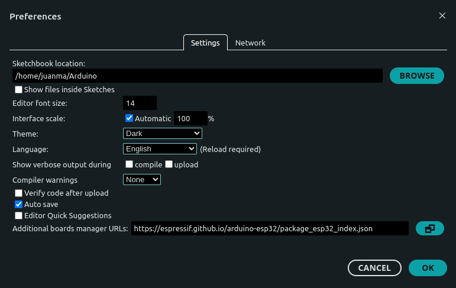
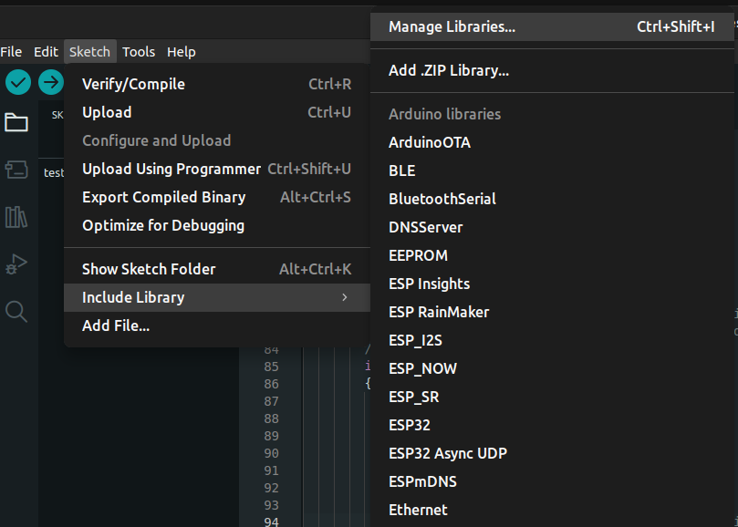
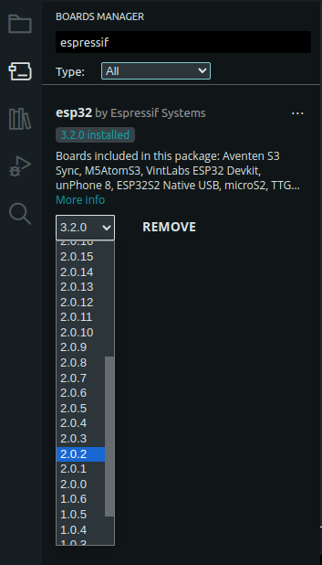
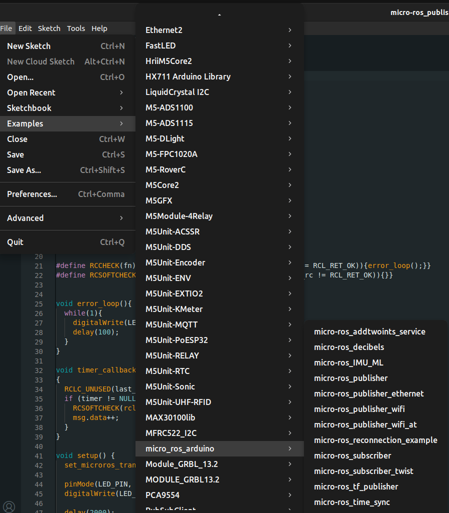

# micro_ros_esp32_apps

A series of esp32 apps for micro ros using FreeRTOS.

Here, I assume you're using Ubuntu 22.04 and you have ROS 2 Humble and the [uma_environment](https://github.com/jmgandarias/uma_environment_tools) installed on your system.
Note that when you install the uma_environment, ROS 2 Humble is automatically installed.

## Install the micro-ROS build system

You only have to do this once. More info [here](https://micro.ros.org/docs/tutorials/core/first_application_rtos/freertos/)

1. Create your micro_ros workspace:
Open a terminal and run

```bash
create_catkin_ws
```

You can call the workspace: microros_ws.

2. Clone the micro-ROS tools

```bash
git clone -b $ROS_DISTRO https://github.com/micro-ROS/micro_ros_setup.git src/micro_ros_setup
sudo apt update && rosdep update
rosdep install --from-paths src --ignore-src -y
sudo apt-get install python3-pip
cdw
cb
nt
```
## Using micro-ros with FreeRTOS

### Creating a new firmware workspace

```bash
ros2 run micro_ros_setup create_firmware_ws.sh freertos esp32
```
Each app is represented by a folder containing the following files:

- `app.c`: This file contains the logic of the application.
. `app-colcon.meta`: This file contains the micro-ROS app specific colcon configuration. Detailed info on how to configure the RMW via this file can be found [here](https://micro.ros.org/docs/tutorials/advanced/microxrcedds_rmw_configuration/).

For the user to create its custom application, a folder <my_app> will need to be registered in this location, containing the two files just described. This is explained in [this section](#create-your-own-app)

### Configuring the firmware

```bash
ros2 run micro_ros_setup configure_firmware.sh [APP] [OPTIONS]
```

The options available for this configuration step are:

- `transport` or `-t`: udp, serial or any hardware-specific transport label
- `dev` or -`d`: agent string descriptor in a serial-like transport
- `ip` or `-i`: agent IP in a network-like transport
- `port` or `-p`: agent port in a network-like transport

For example:

```bash
ros2 run micro_ros_setup configure_firmware.sh ping_pong --transport serial
```

### Building and flashing the firmware

First, don't forget to connect the ESP32 with the USB.

```bash
ros2 run micro_ros_setup build_firmware.sh
```

```bash
ros2 run micro_ros_setup flash_firmware.sh
```

### Creating the micro-ROS agent

```bash
ros2 run micro_ros_setup create_agent_ws.sh
ros2 run micro_ros_setup build_agent.sh
nt
```

### Running the micro-ROS app

```bash
ros2 run micro_ros_agent micro_ros_agent serial --dev [device]
```

First, you need to check the port to which your device is connected, you can check it with

```bash
ls /dev
```

Typically, the ports is `ttyUSB0` or `ttyACM0`.

Example:

```bash
ros2 run micro_ros_agent micro_ros_agent serial --dev /dev/ttyUSB0
```

:warning: Remember that to run the micro ros agent correctly, you need to:
1. Run the agent with the command above.
2. Reset the device. If you don't reset the device after running the micro ros agent, you won't receive an error but the app won't work and you'll see something like:
   
    ```bash
    [1748765297.034062] info     | TermiosAgentLinux.cpp | init                     | running...             | fd: 3
    [1748765297.034355] info     | Root.cpp           | set_verbose_level        | logger setup           | verbose_level: 4
    ```

    If you run step 2 correctly, you will see something like:

    ```bash
    [1748765366.984396] info     | TermiosAgentLinux.cpp | init                     | Serial port not found. | device: /dev/ttyUSB0, error 2, waiting for connection...
    [1748765367.812409] info     | TermiosAgentLinux.cpp | init                     | running...             | fd: 3
    [1748765367.812704] info     | Root.cpp           | set_verbose_level        | logger setup           | verbose_level: 4
    [1748765368.807462] info     | Root.cpp           | create_client            | create                 | client_key: 0x3B092BB5, session_id: 0x81
    [1748765368.807516] info     | SessionManager.hpp | establish_session        | session established    | client_key: 0x3B092BB5, address: 0
    [1748765368.827872] info     | ProxyClient.cpp    | create_participant       | participant created    | client_key: 0x3B092BB5, participant_id: 0x000(1)
    [1748765368.843591] info     | ProxyClient.cpp    | create_topic             | topic created          | client_key: 0x3B092BB5, topic_id: 0x000(2), participant_id: 0x000(1)
    [1748765368.853631] info     | ProxyClient.cpp    | create_publisher         | publisher created      | client_key: 0x3B092BB5, publisher_id: 0x000(3), participant_id: 0x000(1)
    [1748765368.865558] info     | ProxyClient.cpp    | create_datawriter        | datawriter created     | client_key: 0x3B092BB5, datawriter_id: 0x000(5), publisher_id: 0x000(3)
    [1748765368.880623] info     | ProxyClient.cpp    | create_topic             | topic created          | client_key: 0x3B092BB5, topic_id: 0x001(2), participant_id: 0x000(1)
    [1748765368.890704] info     | ProxyClient.cpp    | create_publisher         | publisher created      | client_key: 0x3B092BB5, publisher_id: 0x001(3), participant_id: 0x000(1)
    [1748765368.901961] info     | ProxyClient.cpp    | create_datawriter        | datawriter created     | client_key: 0x3B092BB5, datawriter_id: 0x001(5), publisher_id: 0x001(3)
    [1748765368.917204] info     | ProxyClient.cpp    | create_topic             | topic created          | client_key: 0x3B092BB5, topic_id: 0x002(2), participant_id: 0x000(1)
    [1748765368.927388] info     | ProxyClient.cpp    | create_subscriber        | subscriber created     | client_key: 0x3B092BB5, subscriber_id: 0x000(4), participant_id: 0x000(1)
    [1748765368.938950] info     | ProxyClient.cpp    | create_datareader        | datareader created     | client_key: 0x3B092BB5, datareader_id: 0x000(6), subscriber_id: 0x000(4)
    [1748765368.956680] info     | ProxyClient.cpp    | create_topic             | topic created          | client_key: 0x3B092BB5, topic_id: 0x003(2), participant_id: 0x000(1)
    [1748765368.966997] info     | ProxyClient.cpp    | create_subscriber        | subscriber created     | client_key: 0x3B092BB5, subscriber_id: 0x001(4), participant_id: 0x000(1)
    [1748765368.978492] info     | ProxyClient.cpp    | create_datareader        | datareader created     | client_key: 0x3B092BB5, datareader_id: 0x001(6), subscriber_id: 0x001(4)
    ```

### Use your own app

To create or use your own app, and keep the code well organized in this repo you have to do the following.

1. Open a terminal and run:

```bash
git clone https://github.com/jmgandarias/micro_ros_esp32_apps
```

2. Create a symlink to the app inside the `freertos_apps` folder:

```bash
cdw
cd /firmware/freertos_apps
ln -s $HOME/micro_ros_esp32_apps/[THE_NAME_OF_THE_APP] [THE_NAME_OF_THE_APP]
```

For example:

```bash
cdw
cd firmware/freertos_apps/apps
ln -s $HOME/micro_ros_esp32_apps/ping_pong_test_app ping_pong_test_app
```

3. Go back to step [configuring the firmware](#configuring-the-firmware) and do all the steps again.

## Using micro-ros with Arduino IDE

### Install the Arduino micro-ros library

Go to your Arduino sktechbook location and download the micro-ros library according to your ROS DISTRO.

You can check where your Arduino sktechbook location is if you open the Arduino IDE, and go to File > preferences.



In the Additional boards manager URLs you should introduce the following:
```
https://espressif.github.io/arduino-esp32/package_esp32_index.json
```

If you don't finf the libraries folder inside your Arduino sketchbook folder, create it:
```bash
cd
cd Arduino
mkdir libraries
```

```bash
cd Arduino/libraries
curl -L "https://github.com/micro-ROS/micro_ros_arduino/archive/refs/heads/${ROS_DISTRO}.zip" -o "micro_ros_arduino-${ROS_DISTRO}.zip"
```


Then, install the library from a .ZIP.



Go to the location of your Arduino libraries and install the micro_ros_arduino-$ROS_DISTRO.zip you have just download.

### Select the correct Arduino core for the ESP32 version.

The last version supported can be found [here](https://github.com/micro-ROS/micro_ros_arduino/tree/humble). Check the supported boards table and the ESP32 Dev Module.

At the moment of writing this documentation, the version was v2.0.2.



### Load an example

Go to Filw > example > micro_ros_arduino and open the micro-ros_publisher



Connect your ESP32, select the ESP32 Dev Module board and the correct port and upload the code.

:warning: If you find an error at this point, check the [troubleshooting section]()

### Run the example

First, you need yo create the micro-ROS agent
```bash
ros2 run micro_ros_setup create_agent_ws.sh
ros2 run micro_ros_setup build_agent.sh
nt
```

```bash
ros2 run micro_ros_agent micro_ros_agent serial --dev /dev/ttyUSB0
```

:warning: Remember that to run the micro ros agent correctly, you need to:
1. Run the agent with the command above.
2. Reset the device. If you don't reset the device after running the micro ros agent, you won't receive an error but the app won't work

### Troubleshooting

If when loading the code you find this error:

```cpp
exec: "python": executable file not found in $PATH

Compilation error: exec: "python": executable file not found in $PATH
```

This error means that the Arduino IDE (or the toolchain it's using) is trying to run python, but it can't find the Python executable in your system's PATH.

Some systems (especially Ubuntu/Debian-based) only have python3 installed, but the Arduino tools expect python.

You can fix this by creating a symbolic link:

```bash
sudo ln -s /usr/bin/python3 /usr/bin/python
```

If Python is not installed, install it

```bash
sudo apt update
sudo apt install python3
```

If, after doing this you find this error:

```cpp
Traceback (most recent call last):
  File "/home/juanma/.arduino15/packages/esp32/tools/esptool_py/3.1.0/esptool.py", line 38, in <module>
    import serial
ModuleNotFoundError: No module named 'serial'
exit status 1

Compilation error: exit status 1
```

This error means that the Python script used by the ESP32 toolchain is trying to import the serial module, but it’s not installed. This module comes from the pyserial package.

install pyserial:

```bash
pip3 install pyserial
```

# Using micro-ros with WSL

## Allow USB from WSL
1. Install [usbipd-win](https://github.com/dorssel/usbipd-win/releases) in windows. Download the .msi package and install it.
3. Connect the ESP32 with the USB.
2. Open a command terminal in windows as admin (windows terminal) and run 
  ```shell
  usbipd list
  ``` 
3. One of the entries should be something like (the COM should be the one your ESP32 is connected at):
  ```
  2-2    10c4:ea60  Silicon Labs CP210x USB to UART Bridge (COM9)                 Not shared
  ```
4. Copy the BUSID number (in this case: `<busid>` = `2-2`) and run:
  ```
  usbipd bind --busid <busid>
  ```
5. If you run `usbipd list` again you should see something like:
  ```
  2-2    10c4:ea60  Silicon Labs CP210x USB to UART Bridge (COM9)                 Shared
  ```
6. Attach the USB device to WSL (in this case: `<busid>` = `2-2`):
  ```
  usbipd attach --wsl --busid <busid>
  ```
7. If you run `usbipd list` again you should see something like:
  ```
  2-2    10c4:ea60  Silicon Labs CP210x USB to UART Bridge (COM9)                 Attached
  ```
8. If you open a WSL terminal (terminator) you'll be able to see the USB port at which the ESP32 is connected (usually `ttyUSB0` or `ttyACM0`):
  ```
  l /dev
  ```

:warning: As long as the USB device is connected to WSL, Windows can't use it. Once connected to WSL, any distribution running as WSL 2 can use the USB device. This means that if you want to upload a program to the device you MUST do it from the WSL. I.e., you can't updload a program from the Arduino IDE isntalled in windows, instead, you MUST do it drom the Arduino IDE installed in the WSL. 

If you want to detach the ESP32 from the WSL, open a windows terminal and run:
```
usbipd detach --busid <busid>
```

More instructions [here](https://learn.microsoft.com/es-es/windows/wsl/connect-usb)

## Install Arduino IDE in WSL
 
1. You need to install FUSE
  ```bash
  sudo add-apt-repository universe
  sudo apt install libfuse2
  ```
2. Download the AppImage 64 bits (X86-64) from the [Arduino Software page](https://www.arduino.cc/en/software).
  ```bash
  cd
  wget https://downloads.arduino.cc/arduino-ide/arduino-ide_2.3.6_Linux_64bit.AppImage
  ```
3. You need to first make it an executable file. This is done by:
  ```bash
  chmod +x arduino-ide_2.3.6_Linux_64bit.AppImage
  ```
4. Now you can launch the arduino IDE from the WSL:
  ```bash
   ./arduino-ide_2.3.6_Linux_64bit.AppImage
   ```

5. For convenience, you can create an alias to launch the arduino-IDE
  - Edit the `bashrc`
  ```bash
  gedit ~/.bashrc
  ```
  - Paste the alias command at the end of the file:
  ```bash
  alias arduino_ide='cd && ./arduino-ide_2.3.6_Linux_64bit.AppImage'
  ```
  - Save and close the file.
6. You can easily open the Arduino IDE from the terminal using the `arduino_ide`alias:
  ```bash
  arduino_ide
  ```
